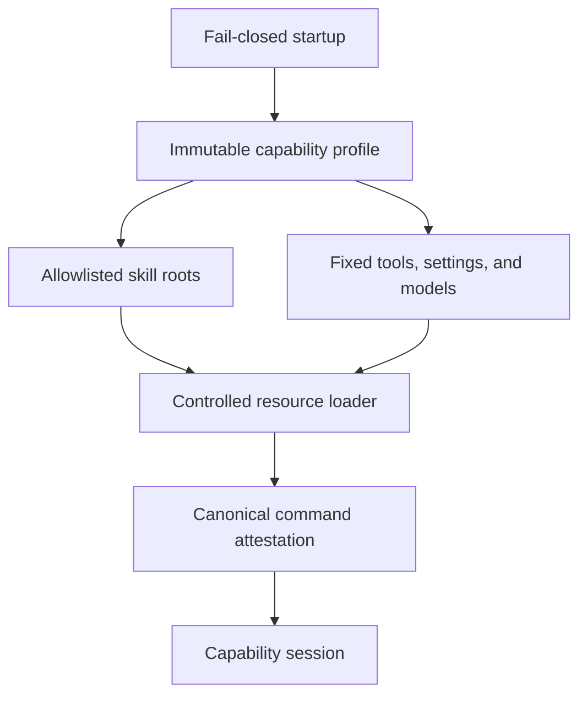

# Automode capability boundary

Automode does not inherit the normal Pi resource surface. `createAutomodeCapabilityProfile` builds an immutable profile from shared native skills, support skills, and pre-attested Automode Stage Skills. Every Automode Stage Skill is preloaded so Automation Stage Operating State can change without widening the capability boundary; the profile exposes `read`, `bash`, `edit`, `write`, `grep`, `find`, and `ls`, the `fast` extension command, and `defaultProjectTrust: "never"`. The Main Session's provider, model, and reasoning are captured as the process-local ordinary Ticket Session execution profile; they are resolved using normal Pi's `models.json` and credentials. The Panel always includes its two fixed provider/model seats and adds the captured execution only when neither fixed seat matches; see [Review Panel and controlled advisory seats](panels.md). The only installed global skills admitted are the fixed `GLOBAL_SKILL_ALLOWLIST`: `browser-harness` and `unslop`. `resolveAllowlistedGlobalSkills` checks both the normal Pi skill directory (from `PI_CODING_AGENT_DIR` or the default under the selected home) and `~/.agents/skills`, resolves real paths, rejects multiple installed sources for one name, and omits missing skills. The child capability session consumes the snapshot root through `AUTOMODE_GLOBAL_SKILL_ROOT`; callers can inject an explicit root for focused tests. The Bridge snapshots admitted copies before handoff, so an installed skill update cannot mutate a live process. The `/automode` command is a process handoff, not an in-place capability toggle: the Main Session can gracefully drain and return to the original normal Pi session, whose resource surface remains outside this profile. The handoff behavior is described in the [launch workflow](../workflows/launch-and-automation.md).

## Session construction

`createCapabilitySession` constructs the **Automode Capability Attestation Session**: it resolves the repository root, creates repository-scoped Automode directories, validates optional project skill paths, and calls `createControlledServices`. The session identity is deliberately attestation-only: its system prompt instructs it to inspect the controlled surface and terminate without tracker work. The controlled service factory uses in-memory settings, the normal credential root only for model authentication, and `noExtensions`, `noSkills`, `noPromptTemplates`, and `noThemes`; it then adds only the profile's skill roots and inline extensions. Repository guidance is filtered to the repository and its direct Markdown references, with `CONTEXT.md` included when present.

Project executable resources are accepted only when `trusted` is true, each path resolves inside the repository, and its `SKILL.md` exists. The capability attestation validates the process-local Main Session/Ticket Session execution profile and the fixed Panel seats, resolving Pi models through normal `models.json`. The Automode Capability Attestation Session is used only for startup attestation and is disposed before the Main Session begins; it is not a Ticket Session.

*Attestation verifies the assembled surface before it can support Automode work.*

## Extension recipe and validation

To add a stage capability, update `STAGE_SKILLS`, add the canonical skill under `skills/automode` and its native counterpart under `skills/native` when appropriate, then extend profile/session tests. To add an always-available skill, update the shared or support lists and test command provenance. To change tools, settings, or execution profiles, update `capability-profile.ts`, the controlled session tests, and startup profile attestation; do not validate only the defining module because shipped capability correctness includes resource-loader registration and canonical command provenance. Use the narrow focused command in the front matter; run `npm test` only for package-wide runtime or public-surface changes.

## Relationships and evidence

The [skill catalog](../skills/catalog.md) is the canonical map of bundled resources. The [architecture overview](overview.md) explains why this boundary is attested before the guarded Main Session and Coordinator lifecycle. `src/attestation.ts` owns command/source collision and provenance checks; `src/fast-mode.ts` is the one built-in extension intentionally added by controlled services.
