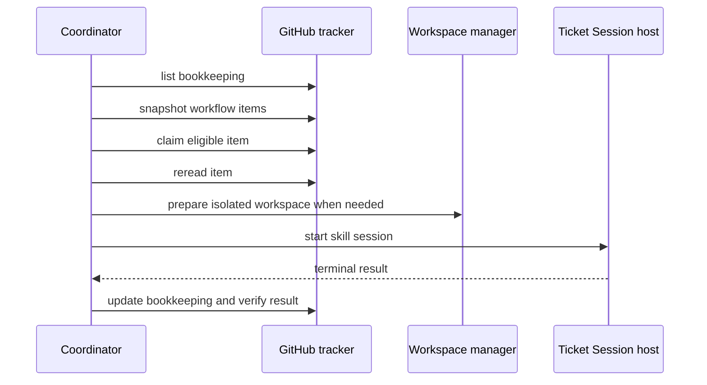

# Automode Coordinator and Ticket Sessions

The Main Session hosts `AutomodeCoordinator`; it is no longer only a startup boundary. `startAutomodeMainSession` wires the Coordinator to `GitHubTracker`, `AutomodeTicketSessionHost`, and `WorkspaceManager`, then uses the existing internal two-phase shutdown lifecycle while the Main Session maps `/drain` and `/exit` onto that boundary. The Coordinator owns discovery and dispatch, while a Ticket Session performs the selected skill work in a child process. The Main Session publishes the Coordinator's projection and activity to the [Coordinator dashboard and Stage Lanes](dashboard.md), which delegates supervisory commands back to this Coordinator rather than performing work itself.

## Reconciliation and dispatch

On `start()`, the Coordinator first reads **all** tracker bookkeeping states: recoverable `running`/`retrying` records are resumed, `awaiting-feedback` records remain idle, and fifth-attempt records are preserved as exhausted. It then takes a material snapshot and dispatches eligible work. A 30-second poll rescans only when the complete snapshot revision changes; `GitHubTracker` includes issue, pull-request, comments/bookkeeping, and each resource's `updated_at` snapshot values, so an `updated_at`-only external change is material. Choices are evaluated in this order: `triage`, `grilling`, `prototype` or `implement`, then `code-review`. Issues must be open, unblocked where applicable, and unassigned or assigned to the authenticated actor; review requires a non-draft pull request. A claim is followed by a fresh read before bookkeeping is written and the session starts. Independent eligible items are launched without a software concurrency cap, so the tracker and per-item bookkeeping remain the coordination boundary rather than a global worker pool.

Each item has an updateable bookkeeping record and a five-attempt budget. A clean Ticket Session is not enough: the Coordinator rereads fresh tracker state and requires the item to no longer be eligible, or (for Auto-Review) requires `merged === true`. Auto-Review cleanup is attempted only after merge proof; cleanup failure is retained as a diagnostic rather than reported as an unmerged success. Prototype `waiting` is recorded as `awaiting-feedback` and resumes the same session only after a changed material snapshot. A missing resume session, a session file from another Automode Run, or a session whose stored stage/configuration is incompatible is replaced with a fresh controlled Ticket Session rather than blocking recovery; the durable bookkeeping record remains the recovery anchor. A missing worktree is reconstructed from its surviving branch. A missing or unwritable fork head fails fast rather than being treated as a local branch.

*The Coordinator separates tracker proof, workspace preparation, child-session execution, and lifecycle bookkeeping.*

## Stage Candidates and live projection

`AutomodeCoordinator.getProjection()` exposes the current lane candidates, totals, polling state, and process-local recent activity. The poll projection records `lastSuccessfulPoll` after each tracker snapshot and `nextScheduledPoll` for the 30-second schedule; `refresh()` performs an immediate full snapshot and eligibility scan. Candidate projection is broader than dispatch: it retains blocked, assigned, human-owned, claimed, waiting, retrying, and exhausted items so the dashboard can explain why work is not running. Each item is assigned to one lane using the same precedence as dispatch—Auto-Triage, Auto-Grilling, Auto-Implement, then Auto-Review—and `setStageOperatingState` controls process-local `ON`, `DRAINING`, and `OFF` behavior without changing the launch baseline or Automode Run Record. The [Coordinator dashboard](dashboard.md) renders this projection and delegates refresh, drain, and stage-state commands back here.

## Ticket Session boundary

`src/ticket-session.ts` defines the versioned IPC contract and `AutomodeTicketSessionHost` (the Coordinator-facing `TicketSessionHost` adapter). It validates the canonical `/skill:<name> <item-url>` prompt, launches `ticket-session-main.ts` as an independent full Pi process, emits `starting`, `ready`, `running`, activity, and terminal events, and supports graceful then forced termination. A missing persisted resume file is replaced with a fresh child session rather than blocking recovery. The child creates an isolated Automode capability session and runs the requested skill; this is distinct from the startup-only Automode Capability Attestation Session. Native Pi session storage supplies the durable logical session identity and history used for resume.

Terminal outcomes are `clean`, `error`, or `waiting`. The Coordinator records `running`, `awaiting-feedback`, `retrying`, `succeeded`, `exhausted`, or `failed`; material-version checks prevent stale child results from being treated as current tracker state, and retries stop at `MAX_ATTEMPTS` (five).

## GitHub and workspace contracts

`GitHubTracker` shells out to `gh`, normalizes issues and pull requests, parses only the Automode bookkeeping marker from comments, and uses compare-and-verify behavior for claims and updates. Its complete snapshot revision incorporates `updated_at` values, not just labels or assignment, so external edits trigger reconsideration. `WorkspaceManager` prepares `.worktree` branches for prototype and implementation issues; review worktrees fetch the exact pull-request head and verify it before use. A missing worktree can be recreated from its surviving branch, while a fork head without a configured writable head remote fails fast. Branch names, revisions, remotes, and paths are validated. Merged review workspaces are cleaned only after successful merge proof, and fork-head branches are not deleted. Auto-Implement creates non-draft pull requests; Auto-Review is the stage that validates, applies warranted fixes, merges, and cleans up after a completed merge.

## Change navigation

- Coordinator policy or lifecycle: change `AutomodeCoordinator` and `test/coordinator.test.ts`; preserve precedence, snapshot gating, reconciliation, and interrupt/drain behavior.
- Child protocol or termination: change `src/ticket-session.ts` and `src/ticket-session-main.ts`; run `test/ticket-session.test.ts` and `test/ticket-session-result.test.ts`.
- GitHub mapping or bookkeeping: change `src/github-tracker.ts` and `test/github-tracker.test.ts`; do not weaken strict normalization or marker parsing.
- Branch/worktree behavior: change `src/workspace.ts` and `test/workspace.test.ts`; validate exact fetched heads and cleanup guards.

The [architecture overview](overview.md) documents startup and the durable Automode Run Record; this page documents the Coordinator/Ticket Session runtime that begins after the Main Session starts.
