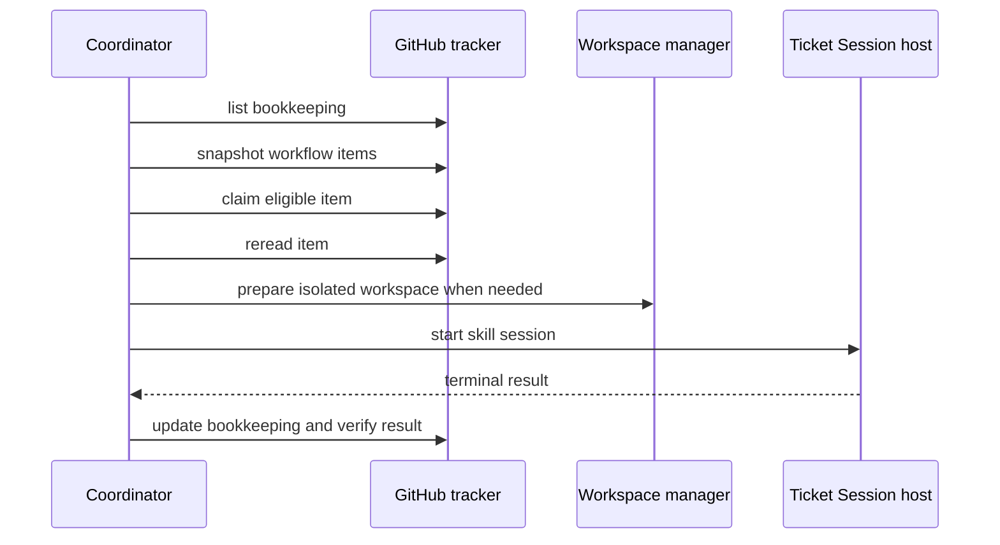

# Automode Coordinator and Ticket Sessions

The Main Session hosts `AutomodeCoordinator`; it is no longer only a startup boundary. `startAutomodeMainSession` wires the Coordinator to `GitHubTracker`, `AutomodeTicketSessionHost`, and `WorkspaceManager`, then uses the existing internal two-phase shutdown lifecycle while the Main Session maps `/automode`, `/drain`, and `/exit` onto that boundary. `/automode` gracefully drains and returns terminal ownership to the original normal Pi session; `/drain` gracefully drains and exits; `/exit` force-stops active Ticket Sessions and exits. The Coordinator owns discovery and dispatch, while a Ticket Session performs the selected skill work in a child process. Panel and native subagent observations are carried as nested activity events, without turning Automode into a native subagent host. The Main Session publishes the Coordinator's projection and activity to the [Coordinator dashboard and Stage Lanes](dashboard.md), which delegates supervisory commands back to this Coordinator rather than performing work itself.

## Reconciliation and dispatch

On `start()`, the Coordinator first reads **all** tracker bookkeeping states. `awaiting-feedback` records remain idle, while recovered `running`, `retrying`, `failed`, and `exhausted` records are normalized to zero prior attempts and can be relaunched at attempt one. This makes the five-attempt budget per Coordinator process, not a durable exhaustion limit across restarts: a new process resets recovered retry/exhaustion state while preserving valid native Ticket Session history, session identity, and workspaces for resume. The accepted rationale is recorded in [`docs/adr/0003-reset-attempt-budgets-on-process-launch.md`](../../docs/adr/0003-reset-attempt-budgets-on-process-launch.md). It then takes a material snapshot and dispatches eligible work. A 30-second poll rescans only when the complete snapshot revision changes; `GitHubTracker` includes issue, pull-request, comments/bookkeeping, and each resource's `updated_at` snapshot values, so an `updated_at`-only external change is material. GitHub's issue and pull-request indexes can briefly disagree during a merge or update: `#workflowSnapshotAttempt` detects missing counterpart entries, retries the complete snapshot once by fetching each incomplete number from the canonical issue and pull-request endpoints, and drops a just-merged closed issue from an open snapshot. Persistent or malformed inconsistency still fails closed rather than producing an ambiguous work list. Choices are evaluated in this order: `triage`, `grilling`, `prototype` or `implement`, then `code-review`. Issues must be open, unblocked where applicable, and unassigned or assigned to the authenticated actor; review requires a non-draft pull request. `spec` and `wayfinder:map` are non-executable issue labels: an issue carrying either label is excluded from implementation dispatch even if it is mistakenly marked `ready-for-agent`, so spec parents cannot become implementation work. A claim is followed by a fresh read before bookkeeping is written and the session starts. Independent eligible items are launched without a software concurrency cap, so the tracker and per-item bookkeeping remain the coordination boundary rather than a global worker pool.

Each item has an updateable bookkeeping record and a five-attempt budget. A clean Ticket Session is not enough: the Coordinator rereads fresh tracker state and requires the item to no longer be eligible, or (for Auto-Review) requires `merged === true`. Auto-Review cleanup is attempted only after merge proof; cleanup failure is retained as a diagnostic rather than reported as an unmerged success. Any Ticket Session that reports `waiting` is held after that one attempt as `awaiting-feedback`; it does not consume another retry until a material tracker update changes the snapshot. Its structured summary is preserved in the bookkeeping diagnostic, emitted as terminal activity, included in the candidate reason, and surfaced in dashboard cards/latest structured activity. When the material update still selects the same Stage Skill, the Coordinator resumes the same session with the waiting attempt preserved; a Stage change releases the old waiting session and follows normal precedence. This is a supported workflow for all Ticket Sessions, not prototype-only behavior. A missing resume session, a session file from another Automode Run, or a session whose stored stage/configuration is incompatible is replaced with a fresh controlled Ticket Session rather than blocking recovery; the durable bookkeeping record remains the recovery anchor. A missing worktree is reconstructed from its surviving branch. A missing or unwritable fork head fails fast rather than being treated as a local branch.

*The Coordinator separates tracker proof, workspace preparation, child-session execution, and lifecycle bookkeeping.*

## Stage Candidates and live projection

`AutomodeCoordinator.getProjection()` exposes the current lane candidates, totals, polling state, and process-local recent activity. Ticket Session projections also expose immutable session timing: `startedAt` is captured when a session identity is accepted (or recovered from history), and `endedAt` is recorded when that session settles; timing is keyed by session ID so a replacement session cannot inherit another session's duration. Bookkeeping persists these optional timestamps for recovery, including waiting sessions. The poll projection records `lastSuccessfulPoll` after each tracker snapshot and `nextScheduledPoll` for the 30-second schedule; `refresh()` performs an immediate full snapshot and eligibility scan. Candidate projection is broader than dispatch: it retains blocked, assigned, human-owned, claimed, waiting, retrying, and exhausted items so the dashboard can explain why work is not running. Each item is assigned to one lane using the same precedence as dispatch—Auto-Triage, Auto-Grilling, Auto-Implement, then Auto-Review—and `setStageOperatingState` controls process-local `ON`, `DRAINING`, and `OFF` behavior without changing the launch baseline or Automode Run Record. The [Coordinator dashboard](dashboard.md) renders this projection and delegates refresh, drain, and stage-state commands back here.

## Ticket Session boundary

`src/ticket-session.ts` defines the versioned IPC contract and `AutomodeTicketSessionHost` (the Coordinator-facing `TicketSessionHost` adapter). Its `ticketSessionRuntimeFingerprint` helper fingerprints the snapshot's compiled JavaScript set so the parent/child runtime cannot silently diverge. The contract is currently `TICKET_SESSION_PROTOCOL_VERSION = 3`: activity rows retain `assistant`, `thinking`, `tools`, and `error`, while also allowing visible `tool` launches and attributed `child` events for `automode_panel` and native `subagent_*` observation. Ordinary tool rows still carry only a positive `toolCount`; nested events are validated before entering Coordinator projections. It validates the canonical `/skill:<name> <item-url>` prompt, launches `ticket-session-main.ts` as an independent full Pi process, emits `starting`, `ready`, `running`, activity, and terminal events, and supports graceful then forced termination. A missing persisted resume file is replaced with a fresh child session rather than blocking recovery. The child creates an isolated Automode capability session and runs the requested skill; this is distinct from the startup-only Automode Capability Attestation Session. Native Pi session storage supplies the durable logical session identity and history used for resume.

The production host fingerprints the JavaScript files beside its child entrypoint when the Coordinator is constructed. In a normal `/automode` launch those files belong to the Bridge-captured immutable **Automode Runtime Snapshot**, so the Ticket Session fingerprint guards that private snapshot against mutation. Before each dispatch it recomputes the fingerprint; a changed snapshot raises `AutomodeRestartRequiredError` instead of launching a potentially incompatible child. The Coordinator persists that item as `failed`, interrupts further dispatch, and requires a full Automode restart before work resumes. Rebuilding the installed development checkout cannot drain an active Coordinator or alter its running snapshot; it affects only a later `/automode` launch. This guard applies to the production launcher (injected test launchers do not fingerprint their fixture runtime), so changes to the shipped parent/child build must be validated at the process boundary rather than only through unit helpers.

`src/ticket-transcript.ts` is the canonical projection seam for child activity. `createAssistantTranscript` accepts completed assistant message content, keeps trimmed bounded assistant text and thinking summaries, collapses ordinary tool calls to counts, and retains `automode_panel` and native `subagent_*` launches as visible tool/nested-session events. Panel seats stream bounded prompt/profile/head/lifecycle/activity data through `NestedSessionEvent` from `src/nested-session.ts`; this is read-only observation and does not add native subagent capabilities to Automode. `ticketSessionActivityFromAgentEvent` in `src/ticket-session-main.ts` emits rows for `message_end` assistant messages (plus explicit retry errors) and validates the nested event shape; lifecycle and streaming/tool execution events are otherwise transport details and are discarded. Persisted history follows the same projection, so live and recovered attempts have the same compact transcript shape. A protocol violation—such as a tools row without a positive count or malformed nested event—is rejected and force-terminates the child rather than entering the dashboard.

Terminal outcomes are `clean`, `error`, or `waiting`. A successful or waiting child result must include a non-empty structured `summary`; `ticket-session-main.ts` validates that shape before sending it over IPC, and `AutomodeTicketSessionHost` rejects a missing summary rather than silently treating the session as settled. The `automode_ticket_result` tool in `src/ticket-session-result.ts` is the producer-side contract: it reports completion or a substantive blocker requiring a material tracker update. A completed `code-review` result additionally requires the authoritative `finalDisposition` Markdown. The child captures whole-session usage, and `GitHubReviewDispositionPublisher` publishes that final validation comment only after the complete Review Session settles; missing Panel seats therefore remain blocking rather than being hidden by partial output. The Coordinator records `running`, `awaiting-feedback`, `retrying`, `succeeded`, `exhausted`, or `failed`; material-version checks prevent stale child results from being treated as current tracker state, and retries stop at `MAX_ATTEMPTS` (five).

## GitHub and workspace contracts

`GitHubTracker` shells out to `gh`, normalizes issues and pull requests, parses only the Automode bookkeeping marker from comments, and uses compare-and-verify behavior for claims and updates. Bookkeeping comments retain a machine-readable base64 payload inside a hidden data marker plus a human-readable status table; diagnostics are rendered safely and sensitive local session paths are not included in the visible table. On reread, issue bodies using either a `## Blocked by` section or a top-of-body `Blocked by:` fallback are checked against GitHub's native dependency relationship count and fail closed when the declared blocker count exceeds native relationships. This prevents prose-only blockers from changing eligibility without corresponding GitHub dependency edges. Its complete snapshot revision incorporates `updated_at` values, not just labels or assignment, so external edits trigger reconsideration. When mapping output pull requests back to issues, a closed pull request with `merged !== true` is ignored: it is an abandoned output and does not conflict with an open or merged pull request that closes the same issue. `WorkspaceManager` prepares `.worktree` branches for prototype and implementation issues; review worktrees fetch the exact pull-request head and verify it before use. A missing worktree can be recreated from its surviving branch, while a fork head without a configured writable head remote fails fast. Branch names, revisions, remotes, and paths are validated. Merged review workspaces are cleaned only after successful merge proof, and fork-head branches are not deleted. Auto-Implement creates non-draft pull requests; Auto-Review is the stage that validates, applies warranted fixes, merges, and cleans up after a completed merge.

## Change navigation

- Coordinator policy or lifecycle: change `AutomodeCoordinator` and `test/coordinator.test.ts`; preserve precedence, snapshot gating, reconciliation, `/automode`/`/drain`/`/exit` behavior, and the exclusion of `spec`/`wayfinder:map` issues from implementation dispatch.
- Child protocol, transcript projection, termination, or runtime compatibility: change `src/ticket-session.ts`, `src/ticket-session-main.ts`, `src/ticket-transcript.ts`, or `src/restart-required.ts`; run `test/ticket-session.test.ts`, `test/ticket-session-result.test.ts`, and the restart case in `test/coordinator.test.ts`. Protocol changes must be validated at the real child-process seam, not only by testing the internal transcript helper.
- GitHub mapping, dependency validation, snapshot reconciliation, or bookkeeping rendering: change `src/github-tracker.ts` and `test/github-tracker.test.ts`; preserve strict normalization, marker parsing, hidden payload decoding, safe visible rendering, fail-closed blocker checks, and the one-shot recovery of transient issue/PR index skew. The focused tests include transiently incomplete snapshots and stale open indexes after merge.
- Branch/worktree behavior: change `src/workspace.ts` and `test/workspace.test.ts`; validate exact fetched heads and cleanup guards.

The [architecture overview](overview.md) documents startup and the durable Automode Run Record; this page documents the Coordinator/Ticket Session runtime that begins after the Main Session starts.
