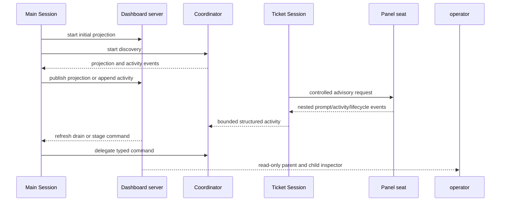

# Automode Coordinator dashboard and Stage Lanes

The `/automode` Main Session starts a Coordinator-owned dashboard before tracker discovery. The browser is the comprehensive supervision surface; the Pi TUI remains a compact status and shutdown surface. The dashboard shows every open **Stage Candidate** in one of four precedence-selected lanes—Auto-Triage, Auto-Grilling, Auto-Implement, and Auto-Review—rather than only showing active Ticket Sessions. The product design is recorded in [`docs/automode-dashboard-design.md`](../../docs/automode-dashboard-design.md) and the architectural decision in [`docs/adr/0001-use-a-local-web-dashboard-for-coordinator-supervision.md`](../../docs/adr/0001-use-a-local-web-dashboard-for-coordinator-supervision.md).

The Main Session status card is implemented by `createAutomodeStatusCard` in `src/main-status-card.ts`. It renders repository and Automode Run Record identity, all four process-local Stage Operating States, candidate totals, last/next poll times, the exact localhost/Tailscale dashboard links, and any Tailscale exposure error. It consumes the same `DashboardProjection` published to the browser, so the TUI is a compact projection rather than a second state store. It registers the terminal-only `/automode`, `/drain`, and `/exit` commands: `/automode` requests a graceful repository-wide drain and returns terminal ownership to the original normal Pi session, `/drain` requests the same graceful drain and exits after active Ticket Sessions settle, while `/exit` force-stops active Ticket Sessions and exits after cleanup. Automode does not intercept `Ctrl-C`, so Pi retains its default TUI behavior. The browser cannot force-stop individual Ticket Sessions.

## Runtime boundary

`CoordinatorDashboard` is the small Main Session-facing seam: `start` with an initial `DashboardProjection`, `publish` replacements, `appendActivity` for structured Ticket Session events, and idempotent `stop`. `src/automode-main.ts` creates it, starts it before `coordinator.start()`, subscribes to Coordinator projection/activity events, routes browser commands to `refresh`, `interrupt`, or `setStageOperatingState`, and stops it during disposal. It does not read GitHub, Pi session files, worktrees, or the Automode Run Record directly; the Coordinator remains the owner of runtime state.

*The Main Session bridges Coordinator state to the browser while commands remain Coordinator-owned; nested Panel activity is observed through the Ticket Session.*

## Network and browser contract

`src/dashboard.ts` prefers `127.0.0.1:41738` (`AUTOMODE_DASHBOARD_LOCAL_URL`) and falls back to an operating-system-selected free loopback port when that port is occupied. It serves the generated static assets from `src/dashboard-ui.ts`, `/api/snapshot`, and a live event stream. The server tries `tailscale serve --bg --yes` for a private `.ts.net` URL; an unavailable or invalid exposure records `exposureError` and preserves localhost-only operation. It adopts an existing root handler only when it targets the dashboard's exact local URL; otherwise it allocates an unused HTTPS port and installs its own root handler. Disposal removes only that exact currently-owned handler, preserving unrelated Tailscale Serve configuration. Different repositories can therefore run Automode concurrently. The Main Session status card always shows the exact local URL and shows the remote URL only after it has been validated as HTTPS on `.ts.net`.

Requests are constrained by an allowlist of loopback and validated private tailnet hosts. Mutation endpoints require POST, an allowed `Origin`, the per-server CSRF token, and the current projection revision through `If-Match`; command bodies are strict and bounded. Security headers disable framing, caching, ambient origins, and non-self resources. The preferred-port collision is handled before Coordinator discovery or claims by selecting a free loopback port.

## Projection, lanes, and controls

`DashboardProjection` is a serialized snapshot containing repository/run identity, lane projections, totals, polling information, and process-local recent/activity state. `createDashboardProjection` maps Coordinator projection data into browser-safe candidates. Each candidate has a visible lifecycle/reason: queued, claimed, running, waiting, retrying, blocked, human-owned, or exhausted. A `waiting` candidate is held after one Ticket Session attempt until its material tracker version changes; its structured summary is retained in bookkeeping and rendered in the candidate reason and latest structured activity/card rather than treated as a prototype-only state. A candidate is shown in at most one lane using the Coordinator's precedence: Auto-Triage, Auto-Grilling, Auto-Implement, then Auto-Review. The projection exposes the last successful poll and next scheduled poll; a browser refresh requests an immediate full snapshot and eligibility scan.

`DashboardCommand` intentionally contains only `refresh`, `drain`, and `set-stage-state`. These control process-local Automation Stage Operating State (`ON`, `DRAINING`, `OFF`); disabling an active Stage drains it before `OFF`, and re-enabling requests a fresh eligibility scan. Operating State is not persisted in the **Automode Run Record**: restart restores the launch Automation Stage Configuration. The browser cannot force-stop individual sessions, reset retry budgets, mutate GitHub, prompt Ticket Sessions, or merge pull requests.

## Activity and lifecycle boundaries

`ticket-session-main.ts` converts completed native Pi assistant messages into bounded structured activity: assistant text and thinking summaries are retained, ordinary tools are represented only by aggregate counts, and `automode_panel` plus native `subagent_*` launches remain visible. The `message_end` projection deliberately ignores lifecycle, streaming, and ordinary tool-execution details, so the browser never receives ordinary tool names, arguments, commands, or result bodies. Panel seats and native subagent launches emit a read-only nested-session stream with bounded prompt/identity, profile or pinned review head when available, lifecycle, assistant/thinking activity, and aggregate tool counts; this observation path does not grant Automode native subagent capabilities. Persisted Pi history is reconstructed through the same `createAssistantTranscript` seam in `src/ticket-transcript.ts`, keeping retry/recovery views consistent with live activity. The dashboard renders these rows as a read-only Pi-like transcript; attempts retain explicit message, byte, per-item, and total limits and mark truncation instead of allowing unbounded browser state. The activity drawer also displays the canonical initial `/skill:<name> <item-url>` prompt for an existing Ticket Session, so operators can compare the requested skill/item identity with later activity without exposing hidden tool payloads. Waiting summaries update both the candidate's activity text and its latest structured activity entry. Recent candidates and activity are process-local and disappear when the Coordinator process exits. Ticket Session conversation history remains in native Pi session storage and is not imported into the Main Session. The activity drawer can close via its close control, Escape, or the dimmed backdrop and restores focus to the selected Stage Candidate.

The dashboard starts before discovery, follows Coordinator lifecycle, and stops during final disposal. A port collision therefore fails startup before tracker reconciliation, snapshots, claims, or other workflow mutations. The Main Session's async disposal waits for Coordinator stop, then stops the dashboard and releases the repository lock; this ordering prevents a live Coordinator from outliving its supervision surface. Browser drain and the Main Session `/automode` and `/drain` commands request only graceful drain; `/automode` additionally returns terminal ownership to the original normal Pi session, `/drain` exits after settling, and `/exit` is terminal-only and force-stops active Ticket Sessions before cleanup and exit. Automode does not intercept `Ctrl-C`, so Pi retains its default TUI behavior. During drain, enabled lanes transition to `DRAINING` when they have active work or directly to `OFF` when idle; re-enabling is a Coordinator operation that triggers a fresh scan.

## Change navigation and validation

- HTTP routes, security checks, Tailscale, event streams, or command parsing: `src/dashboard.ts`; focused coverage is `test/dashboard.test.ts`.
- Projection shape, candidate labels, browser rendering, or accessibility behavior: `src/dashboard-ui.ts`; use `test/dashboard-ui.test.ts`.
- Startup wiring, status-card publication, command delegation, or async shutdown ordering: `src/automode-main.ts` and `src/main-status-card.ts`; pair with `test/main-session.test.ts` and `test/main-status-card.test.ts`.
- Main Session TUI rendering or terminal interrupt behavior: `src/main-status-card.ts`; use `test/main-status-card.test.ts`.
- Candidate precedence, lane state, totals, or Stage Operating State transitions: `src/coordinator.ts`; use the relevant suites in `test/coordinator.test.ts`.
- Structured child-process activity and transcript projection: `src/ticket-session-main.ts`, `src/ticket-session.ts`, `src/ticket-transcript.ts`, and `src/nested-session.ts`; use `test/ticket-session.test.ts`. Preserve ordinary-tool aggregation while keeping `automode_panel` and native `subagent_*` launches visible in the read-only split inspector; the browser proof is `test/dashboard-browser-walkthrough.py`.

Minimal dashboard validation is `npm run build && node --test dist/test/dashboard.test.js dist/test/dashboard-ui.test.js dist/test/main-status-card.test.js dist/test/ticket-session.test.js`. The black-box `/automode` acceptance in `test/dashboard.test.ts` additionally requires the configured Windows PTY/real-Pi environment; run it when changing launch wiring or the shipped browser boundary. Run the broader Coordinator or package suite only when changing cross-boundary lifecycle, projection contracts, or shipped extension registration. Do not add a scheduled OpenWiki CI workflow; repository documentation refresh remains local-only via [`operations.md`](../operations.md).

The dashboard supervises the [Coordinator and Ticket Sessions](coordinator.md); startup ordering and the durable run boundary remain canonical in the [architecture overview](overview.md).
