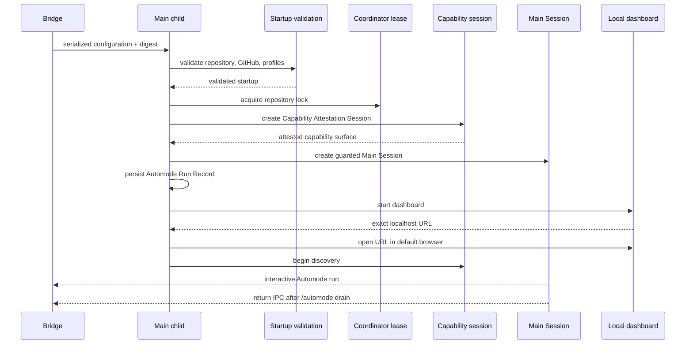

# Architecture overview

The repository now has a concrete `/automode` launch seam. Normal Pi registers the command, shows a stage selector, serializes the selected Automation Stage Configuration baseline, and hands off to a fresh Automode Main Session in a child process.

The current vocabulary in `CONTEXT.md` matches the implementation: Automode is a durable repository-scoped run with a Main Session that hosts the repository-singleton Automode Coordinator. The Bridge also creates an **Automode Runtime Snapshot**: an immutable temporary copy of compiled runtime files, bundled skills, fixed-allowlisted installed global skills (`browser-harness` and `unslop` when present), package metadata, and transitive runtime dependencies used by that Main Session and its Ticket Sessions. After fail-closed startup, the Coordinator dispatches independent full-process Ticket Sessions; the Main Session never performs ticket work. Selector toggles define the launch baseline, while separate process-local Automation Stage Operating State determines current dispatch. Full-Auto requires all four Stages; Half-Auto defaults to Auto-Implement and Auto-Review and accepts any non-empty selection, including all four Stages; all stages may also be OFF at runtime. Startup validates repository identity, GitHub origin binding, required GitHub permission, the authenticated actor, fixed execution profiles, canonical skill provenance, and the live Coordinator lock before work discovery starts. The persisted Coordinator-bound state is the **Automode Run Record**, not the Automode Capability Profile, and it excludes process-local execution profiles and operating state; older `defaultReviewerExecution` data is migrated away on restart. Each `/automode` process resolves its Main Session model from the launching Pi provider/model or normal `models.json`. The capability session used during startup is the **Automode Capability Attestation Session**, not a Ticket Session.

## Implemented architecture

### Bridge and child process boundary

`src/automode-main.ts`, `src/startup.ts`, `src/capability-profile.ts`, `src/global-skills.ts`, `src/capability-session.ts`, `src/controlled-services.ts`, and `src/coordinator-lock.ts` implement the startup and session boundary. `src/launch.ts` creates the Automode Runtime Snapshot before `handoffTerminal`; `src/runtime-snapshot.ts` copies `package.json`, compiled `dist/src`, bundled `skills`, allowlisted installed global skill directories, and reachable dependency packages, fingerprints source and copy both during capture and before returning, and disposes the temporary tree after child exit. The bridge/launch seam serializes the selected Automation Stage Configuration, hands it to the child process, and the child rejects tampered payloads before Main Session startup. After the dashboard binds, `startAutomodeMainSession` opens its exact validated loopback URL through `openLocalDashboard` before Coordinator discovery. `createCapabilitySession` is specifically the startup-only Automode Capability Attestation Session; [Coordinator and Ticket Sessions](coordinator.md) owns the later work-dispatch boundary.

### Process launch configuration

`src/stage-configuration.ts` defines the four stages, the Full-Auto/Half-Auto modes, and the validation rules: Full-Auto requires all four stages, while Half-Auto accepts any non-empty selection, including all four. `src/startup.ts` validates repository identity, GitHub origin binding, required permission, and execution profiles; `src/automode-main.ts` persists the confirmed **Automode Run Record** only after startup validation and capability attestation succeed. Within one live Coordinator process, the selected Automation Stage Configuration remains fixed. After that Coordinator stops, a later `/automode` launch may replace the stored latest launch baseline, while the record's `version`, `coordinatorId`, and explicitly allowlisted project resources remain fixed. The capability profile remains the in-memory allowlist used to construct and attest sessions.

### Main Session, Coordinator, and ticket boundary

The Main Session is started with an Automode-specific system prompt and an extension that cancels session switching and forking. It starts the Coordinator, which dispatches independent Ticket Sessions; the Main Session is never a ticket worker. `src/coordinator-lock.ts` keeps the durable Coordinator identity and the live `coordinator.lock` under the repository Git common directory, so different home/config roots still contend for the same repository-level Coordinator.

### Startup binding and stage model

Startup binds `gh` authentication to `github.com`, requires that the remote `origin` resolve to the same GitHub repository as the local checkout, requires GitHub WRITE permission, and resolves the authenticated actor from `gh auth status --active` metadata before work discovery starts. The login is validated and passed to `AutomodeCoordinator` as the actor used for assignment and claim decisions. `src/startup.ts` also authenticates Claude Code and runs an exact configured model/reasoning probe for every ordinary and Panel execution profile, because any Stage may be enabled process-locally; a reported probe error fails closed. Transient GitHub startup failures are retried for up to 30 seconds before that failure boundary. `src/capability-profile.ts` and `src/capability-session.ts` define the fixed execution profiles, canonical skill provenance, and controlled-service boundaries. The MVP still has four independently selectable stages: Auto-Triage, Auto-Grilling, Auto-Implement, and Auto-Review. Full-Auto enables all four; Half-Auto defaults to Auto-Implement and Auto-Review and may enable any non-empty selection; planning remains human-controlled.

### Run and Coordinator lifecycle

`startAutomodeMainSession` verifies the confirmed configuration, validates the repository and GitHub binding, attests required execution profiles, acquires the repository Coordinator lease, creates and disposes the **Automode Capability Attestation Session**, creates the Main Session, and only then persists the latest launch baseline in the Automode Run Record at `automode-run.json`. The record contains the Coordinator ID, stage configuration, and project-resource selection; the capability profile itself remains an in-memory allowlist. Any failure disposes the provisional runtime and releases the lease. `acquireRepositoryCoordinator` stores a durable UUID in `coordinator-identity.json` and uses `coordinator.lock` with stale-lock recovery; the Git common-directory paths from `src/paths.ts` make linked worktrees and different Pi homes contend for the same owner and run record. A second live owner fails closed. After a clean stop releases the lock, a later launch reuses the identity and fixed project resources while replacing the latest stored stage configuration; the new process initializes its Stage Operating State from that selection. The internal Coordinator lifecycle remains two-phase, but the public controls are the Main Session slash commands: `/automode` gracefully drains, sends a return-to-normal request over the child-process handoff, and returns terminal ownership to the original normal Pi session; `/drain` gracefully drains and exits after active Ticket Sessions settle; and `/exit` force-stops active Ticket Sessions before exit. Automode does not intercept `Ctrl-C`, so Pi retains its default TUI behavior. Main-session disposal does not release the Coordinator lock until `whenStopped()` resolves, so the lock cannot be removed while work is still live.

*The ordering is fail-closed: no run record or work discovery precedes validation and attestation.*

### Separate WeChat integration boundary

Personal-WeChat/OpenClaw channel integration is still explicitly outside the Automode MVP and remains a future adjacent boundary; see the [WeChat integration note](../integrations/wechat.md).

## Change navigation and validation

Start runtime changes at the owning symbol above, then follow the adjacent [capability boundary](capability-boundary.md), [Coordinator and Ticket Sessions](coordinator.md), or [launch workflow](../workflows/launch-and-automation.md). Keep the focused tests in the front matter narrow. Use the full `npm test` only when changing package-wide lifecycle, public registration, or cross-boundary behavior; `npm run prove:handoff` is conditional for process-terminal handoff changes.

## What future agents should start with

When implementation evolves, document:

1. deeper Coordinator recovery policy and production tracker operational runbooks
2. the boundary between normal Pi config and Automode config
3. production operational runbooks for GitHub polling, tracker failures, and recovery
4. the interface between Automode and any future WeChat integration

## Evidence

- [`README.md`](../../README.md)
- [`CONTEXT.md`](../../CONTEXT.md)
- [`docs/automode-launch.md`](../../docs/automode-launch.md)
- [`src/bridge.ts`](../../src/bridge.ts)
- [`src/launch.ts`](../../src/launch.ts)
- [`src/automode-main.ts`](../../src/automode-main.ts)
- [`src/stage-configuration.ts`](../../src/stage-configuration.ts)