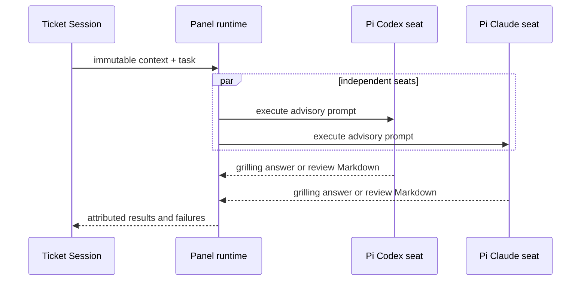

# Review Panel and controlled advisory seats

Auto-Grilling and Auto-Review use a controlled Panel runtime rather than allowing the Main Session or Coordinator to make stage decisions. `runGrillingPanel` and `runReviewPanel` fan out to exactly two independent seats in the current MVP: Pi / `openai-codex/gpt-5.6-sol` / high reasoning and Pi / `github-copilot/claude-fable-5` / high reasoning. Production launches are supplied through the `PanelSeatLauncher` seam and `CliPanelProcessLauncher`; peers do not see one another's answers. The authoritative Grilling Session or Review Session receives the advisory results and remains responsible for decisions and tracker progression. The runtime can represent configured seat lists, but the shipped Automode configuration currently contains these two seats.

*Panel seats advise; the owning Ticket Session decides what to do with their results.*

## Boundary and invariants

`src/ticket-panel-extension.ts` provides the controlled `automode_panel` advisory tool for `grilling` and `review`, using TypeBox parameters and returning structured results. Its tools are read-only and scoped to the task context; a Panel seat cannot advance a queue, dispatch a stage, ask the human, mutate tracker state, or merge a pull request. `src/panel-process.ts` implements the production `CliPanelProcessLauncher`, which starts controlled `pi --mode json` or `claude --print --output-format json` processes for the exact execution profile and disables ambient Pi resources and context. Grilling output is parsed as structured JSON; Review output is preserved as non-empty Markdown for the parent Review Session to interpret. For Pi seats, it invokes the launching Pi package's `dist/bundle/cli.js` through `process.execPath` rather than an npm command shim; `src/launch.ts` supplies that package location as `AUTOMODE_PI_PACKAGE_DIR`, and `ticket-session-main.ts` requires it before constructing a Panel launcher. This keeps the child invocation spawnable on Windows while preserving the launching package. There is no `PanelRuntime` class, `PanelProcessHost`, versioned panel IPC, or seat cleanup protocol.

`runReviewPanel` returns every completed, attributed Markdown report alongside `PanelSeatFailure` diagnostics; it does not throw a review quorum `PanelRuntimeError` or discard successful reports. The Review Session publishes completed reports as commit-pinned GitHub pull-request reviews with inline comments, but failed or unusable seats remain missing and block disposition, fixes, and merge. Grilling retains its structured answer contract and its own failure policy. Empty or malformed seat output is recorded as a failure rather than treated as advice.

Review context is pinned to the exact pull-request head by the workspace and review flow. Grilling and review seats therefore inspect the same immutable starting point, while hidden peer answers preserve independent judgment. The configurable Panel is not a general-purpose worker pool and should not be changed to provide concurrency for ordinary Ticket Sessions. The repository's focused runtime description is [docs/panel-runtime.md](../../docs/panel-runtime.md), and the higher-level coordinator supervision design is [docs/automode-dashboard-design.md](../../docs/automode-dashboard-design.md) with its ADR at [docs/adr/0001-use-a-local-web-dashboard-for-coordinator-supervision.md](../../docs/adr/0001-use-a-local-web-dashboard-for-coordinator-supervision.md).

## Change navigation

- Seat fan-out, report collection, or failure policy: change `runGrillingPanel` / `runReviewPanel` in `src/panel-runtime.ts` and `test/panel-runtime.test.ts`; preserve independent attribution and the distinction between grilling JSON and review Markdown.
- CLI process launch or output normalization: change `CliPanelProcessLauncher` in `src/panel-process.ts`; when changing Pi package propagation, also inspect `src/launch.ts` and `src/ticket-session-main.ts`. Run `test/panel-process.test.ts`.
- Seat failure diagnostics or Review Session handoff: change `PanelSeatFailure` handling in `src/panel-runtime.ts` and the reporting path in `src/ticket-panel-extension.ts`; run `test/panel-runtime.test.ts` and `test/ticket-panel-extension.test.ts`. Do not restore quorum throwing or model-authored structured Review JSON.
- Advisory tool permissions or context shaping: change `src/ticket-panel-extension.ts` and `test/ticket-panel-extension.test.ts`.
- Stage integration belongs in the [Coordinator and Ticket Sessions](coordinator.md) page and its focused tests. The [capability boundary](capability-boundary.md) remains canonical for allowlists and execution attestation, and the dashboard design/ADR explain the stage control surface.

Use the focused command in front matter for ordinary changes. Run the broader package suite only when changing the shared process protocol, shipped extension registration, or cross-stage lifecycle.
