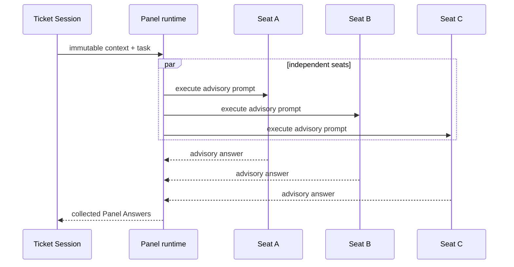

# Review Panel and controlled advisory seats

Auto-Grilling and Auto-Review use a controlled Panel runtime rather than allowing the Main Session or Coordinator to make stage decisions. `runGrillingPanel` and `runReviewPanel` fan out to a configurable set of independent seats, and the current MVP uses three seats: the default Pi seat captured from the provider and model active when `/automode` launches, plus the configured Pi / `github-copilot/claude-fable-5` and Pi / `openai-codex/gpt-5.6-sol` seats, all at high reasoning. Production launches are supplied through the `PanelSeatLauncher` seam and `CliPanelProcessLauncher`; peers do not see one another's answers. The authoritative Grilling Session or Review Session receives the advisory results and remains responsible for decisions and tracker progression.

*Panel seats advise; the owning Ticket Session decides what to do with their results.*

## Boundary and invariants

`src/ticket-panel-extension.ts` provides the controlled `automode_panel` advisory tool for `grilling` and `review`, using TypeBox parameters and returning structured results. Its tools are read-only and scoped to the task context; a Panel seat cannot advance a queue, dispatch a stage, ask the human, mutate tracker state, or merge a pull request. `src/panel-process.ts` implements the production `CliPanelProcessLauncher`, which starts controlled `pi --mode json` or `claude --print --output-format json` processes for the exact execution profile, disables ambient Pi resources and context, and validates direct structured JSON output. There is no `PanelRuntime` class, `PanelProcessHost`, versioned panel IPC, or seat cleanup protocol. Runtime result collection rejects incomplete or malformed results rather than silently treating them as advice.

Review context is pinned to the exact pull-request head by the workspace and review flow. Grilling and review seats therefore inspect the same immutable starting point, while hidden peer answers preserve independent judgment. The three-seat configuration is not a general-purpose worker pool and should not be changed to provide concurrency for ordinary Ticket Sessions. The repository's focused runtime description is [docs/panel-runtime.md](../../docs/panel-runtime.md).

## Change navigation

- Seat fan-out, result collection, or failure policy: change `runGrillingPanel` / `runReviewPanel` in `src/panel-runtime.ts` and `test/panel-runtime.test.ts`.
- CLI process launch or structured-output validation: change `CliPanelProcessLauncher` in `src/panel-process.ts` and `test/panel-process.test.ts`.
- Advisory tool permissions or context shaping: change `src/ticket-panel-extension.ts` and `test/ticket-panel-extension.test.ts`.
- Stage integration belongs in the [Coordinator and Ticket Sessions](coordinator.md) page and its focused tests. The [capability boundary](capability-boundary.md) remains canonical for allowlists and execution attestation.

Use the focused command in front matter for ordinary changes. Run the broader package suite only when changing the shared process protocol, shipped extension registration, or cross-stage lifecycle.
