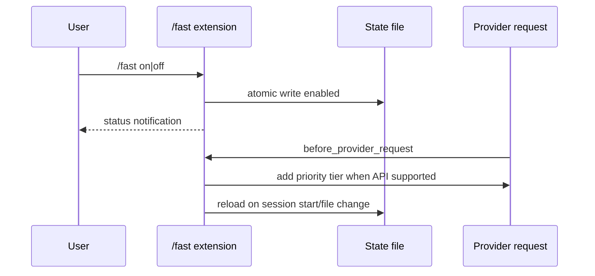

# Automode fast mode

`createAutomodeFastModeExtension` is injected by `createControlledServices`; it is not ambient normal-Pi configuration. The `/fast`, `/fast on`, `/fast off`, and `/fast status` commands manage `openai-fast-mode.json` under the configured normal agent directory. Writes use a temporary file and rename, with mode `0600`.

When enabled and the selected model uses `openai-responses` or `openai-codex-responses`, the `before_provider_request` hook adds `service_tier: "priority"`. Other APIs receive the request unchanged and the status indicator is hidden. Session start reloads the persisted boolean, watches the containing directory for external changes, and updates status after a short debounce; shutdown clears timers and closes the watcher.

*The persisted flag controls request decoration, not model selection or unsupported providers.*

## Change guidance

Keep state parsing, atomic persistence, supported-API gating, lifecycle watcher cleanup, and command UX covered together. The capability-session tests exercise the controlled extension surface; the real Pi smoke test protects package registration. Run the focused command above, and escalate to `npm test` if changing extension registration or the public package surface.

This integration shares the controlled-service boundary documented in the [capability boundary](../architecture/capability-boundary.md); it is separate from the planned [Personal WeChat integration](wechat.md).
